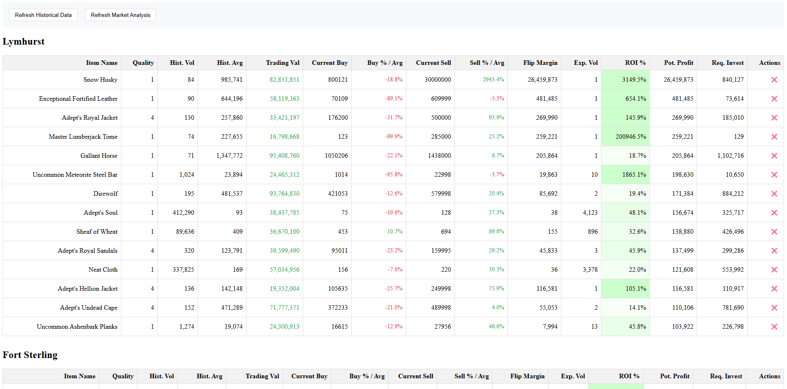

# Albion Online Market Tools

A web-based tool for analyzing Albion Online market data to identify profitable flip opportunities. The tool maintains a database of historical market data, analyzes current market prices from the Albion Online API, and presents profitable flipping opportunities through an interactive web interface.



## Features

- **Interactive Web Interface:** Real-time market data viewer with editable prices and dynamic updates
- **Historical Data Analysis:** Tracks and analyzes market history to identify high-volume items
- **Smart Filtering:** Automatically filters opportunities based on:
  - Minimum profit threshold (configurable)
  - Expected daily volume
  - Market fees and taxes
- **Multi-City Support:** Analyzes opportunities across all major cities
- **Real-time Updates:** Update prices directly in the interface and see recalculated profits
- **Manual Controls:** Delete or filter out opportunities that don't interest you

## Architecture

The application consists of several key components:

- **Web Interface (`web_viewer.py`):**
  - Flask-based web server
  - Real-time market data display
  - Interactive price updates
  - Manual item filtering

- **Market Analysis (`analysis.py`):**
  - Historical data analysis
  - Item volume tracking
  - Market value calculations

- **Flip Calculator (`flip_calculator.py`):**
  - Profit margin calculations
  - Market fee considerations
  - Volume-based opportunity filtering

- **Database Management (`database.py`):**
  - SQLite database for historical data
  - Efficient data querying
  - Automatic data cleanup

- **API Integration (`api_client.py`):**
  - Rate-limited API access
  - Batched requests
  - Gzip compression support

## Installation

1. **Clone the Repository:**
   ```bash
   git clone https://github.com/yourusername/albion-market-tools.git
   cd albion-market-tools
   ```

2. **Create a Virtual Environment:**
   ```bash
   python -m venv venv
   source venv/bin/activate   # On Windows use: venv\Scripts\activate
   ```

3. **Install Dependencies:**
   ```bash
   pip install -r requirements.txt
   ```

## Configuration

The application is configured through several files:

### `config.py`
- API endpoints and regions
- City configurations
- Database settings
- Flip calculator parameters:
  - Minimum profit threshold
  - Number of items to analyze
  - Number of opportunities to display

### Database Setup
The application automatically creates and manages its SQLite database. The database stores:
- Historical market data
- Item volume statistics
- Price trends

## Usage

1. **Start the Web Server:**
   ```bash
   python main.py
   ```
   This will start the web server on `http://localhost:5000`

2. **View Market Opportunities:**
   - Open your browser to `http://localhost:5000`
   - View current flip opportunities across all cities
   - Sort by various metrics (profit, ROI, etc.)

3. **Interact with the Interface:**
   - Click prices to edit them and see recalculated profits
   - Use the delete button (❌) to remove uninteresting opportunities
   - Use the refresh buttons to update historical data or current analysis

## Project Structure

```
albion-market-tools/
├── web_viewer.py         # Web interface and Flask routes
├── analysis.py           # Market analysis logic
├── flip_calculator.py    # Profit calculation engine
├── database.py          # Database management
├── api_client.py        # Albion Online API client
├── history_fetcher.py   # Historical data collection
├── config.py            # Configuration settings
├── main.py             # Application entry point
├── requirements.txt    # Python dependencies
├── templates/          # HTML templates
│   └── market_viewer.html  # Main interface template
├── data/              # Database and cache directory
└── img/               # Image assets
    └── screenshot.png  # UI screenshot
```

## Development

### Key Components

- **Web Viewer (`web_viewer.py`):**
  - Handles all web routes and API endpoints
  - Manages the current market data state
  - Processes user interactions

- **Market Analyzer (`analysis.py`):**
  - Processes historical market data
  - Identifies high-volume items
  - Calculates market statistics

- **Flip Calculator (`flip_calculator.py`):**
  - Implements the core profit calculation logic
  - Applies filtering rules
  - Handles market fees and taxes


## Contributing

1. Fork the repository
2. Create a feature branch
3. Make your changes
4. Submit a pull request

## License

This project is licensed under the MIT License - see the LICENSE file for details.

